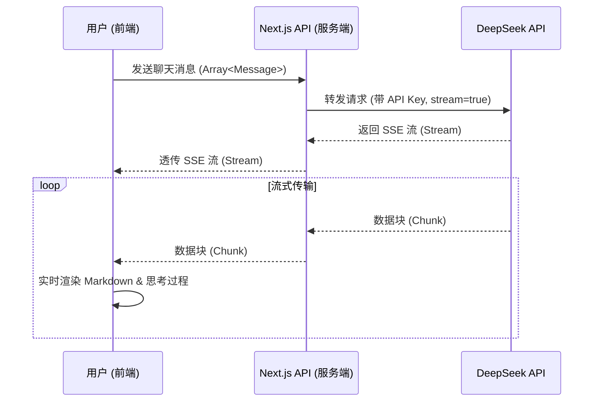

# DeepSeek API 集成指南 (Next.js 项目)

本文档描述了如何将 DeepSeek API (包括 V3 和 R1/思考模式) 集成到当前的 Next.js 项目中。方案注重**响应速度**、**流式输出**以及**数据安全**。

## 1. 架构设计

为了保护 API Key 并解决跨域问题，我们采用 Next.js API Route 作为中间层转发请求。



## 2. 准备工作

### 2.1 获取 API Key
访问 [DeepSeek 开放平台](https://platform.deepseek.com/) 获取 API Key。

### 2.2 配置环境变量
在项目根目录的 `.env` 或 `.env.local` 文件中添加：

```env
DEEPSEEK_API_KEY=sk-xxxxxxxxxxxxxxxxxxxxxxxxxxxxxxxx
# 基础 URL (通常不需要改，除非使用 Beta 功能)
DEEPSEEK_BASE_URL=https://api.deepseek.com
```

## 3. 后端实现 (Next.js API Route)

创建文件 `src/app/api/chat/deepseek/route.ts`。此接口负责将请求转发给 DeepSeek 并流式返回。

**关键点：**
- 使用 Edge Runtime (可选) 或 Node.js Runtime (推荐兼容性)。
- 透传 DeepSeek 的 SSE (Server-Sent Events) 响应。
- 此时不依赖 `openai` SDK，直接用原生 `fetch` 减少包体积。

```typescript
// src/app/api/chat/deepseek/route.ts
import { NextResponse } from 'next/server';

// 强制动态模式，防止缓存
export const dynamic = 'force-dynamic';

const DEEPSEEK_API_KEY = process.env.DEEPSEEK_API_KEY;
const DEEPSEEK_BASE_URL = process.env.DEEPSEEK_BASE_URL || 'https://api.deepseek.com';

export async function POST(req: Request) {
  if (!DEEPSEEK_API_KEY) {
    return NextResponse.json({ error: 'DeepSeek API Key not configured' }, { status: 500 });
  }

  try {
    const { messages, model = 'deepseek-chat' } = await req.json();

    // 构造请求给 DeepSeek
    const response = await fetch(`${DEEPSEEK_BASE_URL}/chat/completions`, {
      method: 'POST',
      headers: {
        'Content-Type': 'application/json',
        'Authorization': `Bearer ${DEEPSEEK_API_KEY}`,
      },
      body: JSON.stringify({
        model: model, // 'deepseek-chat' 或 'deepseek-reasoner'
        messages: messages,
        stream: true, // 开启流式
        temperature: 1.3, // DeepSeek 建议通用对话设为 1.3
        max_tokens: 4000
      }),
    });

    if (!response.ok) {
        const error = await response.text();
        return NextResponse.json({ error: `DeepSeek API Error: ${response.statusText}`, details: error }, { status: response.status });
    }

    // 创建一个 TransformStream 来处理流透传
    // 这里可以直接返回 response.body，但在 Next.js 中最好封装一下以确保正确的 Headers
    const stream = new ReadableStream({
      async start(controller) {
        if (!response.body) return;
        const reader = response.body.getReader();
        
        try {
          while (true) {
            const { done, value } = await reader.read();
            if (done) break;
            controller.enqueue(value);
          }
        } catch (err) {
            console.error('Stream reading error:', err);
            controller.error(err);
        } finally {
          controller.close();
        }
      },
    });

    return new NextResponse(stream, {
      headers: {
        'Content-Type': 'text/event-stream',
        'Cache-Control': 'no-cache',
        'Connection': 'keep-alive',
      },
    });

  } catch (error) {
    console.error('API Route Error:', error);
    return NextResponse.json({ error: 'Internal Server Error' }, { status: 500 });
  }
}
```

## 4. 前端实现 (ChatWidget 组件改造)

需要改造 `src/components/dashboard/ChatWidget.tsx` 以支持：
1. 发送 `POST` 请求。
2. 解析 SSE 流。
3. 渲染 Markdown (使用项目已有的 `react-markdown`)。
4. **支持思考模式**: 显示 `reasoning_content`。

### 核心流处理逻辑 (Helper Function)

```typescript
// utils/streamParser.ts (建议新建此文件或放在 hooks 中)
export async function* streamReader(response: Response) {
  const reader = response.body?.getReader();
  const decoder = new TextDecoder();
  if (!reader) return;

  try {
    while (true) {
      const { done, value } = await reader.read();
      if (done) break;
      
      const chunk = decoder.decode(value, { stream: true });
      const lines = chunk.split('\n');
      
      for (const line of lines) {
        if (line.startsWith('data: ')) {
          const data = line.slice(6);
          if (data === '[DONE]') return;
          try {
            const json = JSON.parse(data);
            yield json;
          } catch (e) {
            console.warn('JSON Parse error in stream:', e);
          }
        }
      }
    }
  } finally {
    reader.releaseLock();
  }
}
```

### 组件逻辑概要

```tsx
// 在原有 ChatWidget.tsx 基础上修改

// 1. 状态增加
const [isThinking, setIsThinking] = useState(false);
const [currentReasoning, setCurrentReasoning] = useState(""); // 思考过程
const [model, setModel] = useState("deepseek-chat"); // 或 "deepseek-reasoner"

// 2. 发送逻辑
async function send() {
  // ... 添加 user message 到 list ...
  
  try {
    const res = await fetch('/api/chat/deepseek', {
        method: 'POST',
        body: JSON.stringify({ messages: newHistory, model }),
        // ...
    });

    // 开始读取流
    let fullContent = "";
    let fullReasoning = "";
    
    // 假设我们有一个 assistant message 占位符在 list 中
    
    for await (const chunk of streamReader(res)) {
        const delta = chunk.choices[0]?.delta;
        
        // 处理思考过程 (DeepSeek R1)
        if (delta?.reasoning_content) {
            fullReasoning += delta.reasoning_content;
            // 更新 UI 显示思考中...
        }
        
        // 处理正文
        if (delta?.content) {
            fullContent += delta.content;
            // 更新 UI 显示正文
        }
    }
  } catch(e) {
      // 错误处理
  }
}
```

## 5. 注意事项

1.  **Rate Limiting (限速)**: DeepSeek 不限并发，但高负载时可能会延迟响应。如果遇到空行或 keep-alive，前端读取器会自动处理（忽略非 `data:` 开头的行）。
2.  **Context Window (上下文窗口)**: 默认为 64K。多轮对话中，为了节省 Token，DeepSeek 建议**不要**回传上一轮的 `reasoning_content` (思维链)，只回传 `content` (最终答案)。在前端维护 `messages` 数组时，发送给 API 前需要过滤掉 `reasoning_content` 字段。
3.  **JSON Mode**: 如果需要结构化输出，Prompt 必须包含 "json" 字样，并且在 API 请求体中设置 `response_format: { type: 'json_object' }`。
4.  **Markdown**: DeepSeek 输出通常包含 Markdown，务必使用 `<ReactMarkdown>` 组件渲染，并引入代码高亮插件。
